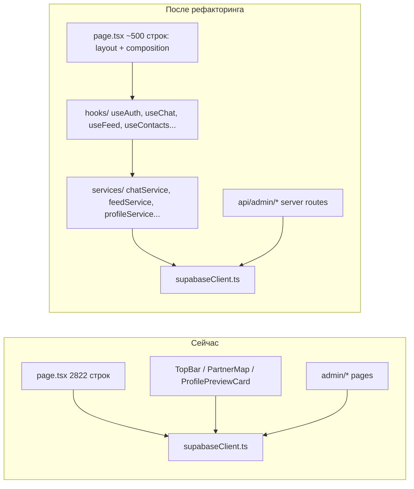

# План рефакторинга: модульность и безопасность

> Утверждён: 2026-05-12

## Статус выполнения

- [x] **Фаза 4** — удалён мусорный `supabaseClient.ts.rtf`, общие типы в `src/types/index.ts`
- [x] **Фаза 1** — каталог `src/services/` (`authService`, `chatService`, `contactService`, `feedService`, `profileService`), вызовы вынесены из `page.tsx`, `TopBar`, `ProfilePreviewCard`, `PartnerMap`
- [x] **Фаза 2** — `src/hooks/` (`useAuth`, `useFeed`, `useChat` / realtime, `useContacts`, `useProfiles`, `useMobileNav`), `page.tsx` разбит на хуки (объём уменьшен, композиция через хуки)
- [x] **Фаза 3a** — `src/middleware.ts`: сессия + проверка `admin_users` для `/admin/*`
- [x] **Фаза 3b** — `src/app/api/admin/users/route.ts`, `src/app/api/admin/posts/route.ts` (service_role после проверки роли); мутации на стороне `/admin/users` и `/admin/posts` через fetch
- [x] **Фаза 3c** — скрипт аудита RLS: `docs/supabase_admin_rls_audit.sql`

Примечание: остальные админ-страницы и `AdminShell` по-прежнему используют клиентский `supabase` для чтения; критичные мутации users/posts переведены на API.

## Текущее состояние

(Исходное описание до рефакторинга; актуальный статус — в разделе «Статус выполнения».)

- **`src/app/page.tsx`** -- 2822 строки; содержит ВСЮ логику: авторизация, лента постов, карта, личные чаты, контакты, блокировки, realtime, фильтры, поллинг. Это главная боль.
- **15 файлов** напрямую импортируют `supabase` из `@/lib/supabaseClient` без промежуточного слоя -- компоненты (`TopBar`, `ProfilePreviewCard`, `PartnerMap`), страницы, админка.
- **Нет каталога `hooks/`** и **нет сервисного слоя** (`services/`) для работы с данными.
- **Admin-панель** работает через anon-клиент с RLS; серверной проверки роли нет -- вся защита зависит от политик в БД.
- **API routes** только 2 (push dispatch + subscribe).

## Архитектура: до и после



## Фаза 1 -- Сервисный слой (убрать `.from()` из компонентов)

Создать каталог `src/services/` с модулями, инкапсулирующими все Supabase-запросы. Каждый модуль экспортирует функции, а не клиент:

- **`src/services/chatService.ts`** -- `fetchChats`, `fetchMessages`, `sendMessage`, `editMessage`, `createOrGetChat`, `subscribeToMessages` (realtime)
- **`src/services/feedService.ts`** -- `fetchPosts`, `createPost`, `editPost`, `deletePost`, `fetchComments`, `addComment`
- **`src/services/profileService.ts`** -- `fetchProfiles`, `fetchProfileById`, `updateProfile`, `updateLastSeen`
- **`src/services/contactService.ts`** -- `fetchContacts`, `addContact`, `removeContact`, `fetchBlocks`, `blockProfile`, `unblockProfile`, `fetchViews`, `markViewed`
- **`src/services/authService.ts`** -- `getCurrentUser`, `signOut`, `onAuthChange`

Все модули импортируют `supabase` **внутри себя**. Компоненты и страницы получают только типизированные функции.

Ключевые файлы для переноса логики:
- `src/app/page.tsx` -- основная масса вызовов `.from()`, `.select()`, `.insert()`, `.update()`, `.delete()`
- `src/components/TopBar.tsx` -- `profiles.update(last_seen_at)`, `profile_contacts.select()`
- `src/components/ProfilePreviewCard.tsx` -- `profiles.select()`, рейтинг
- `src/components/PartnerMap.tsx` -- нет прямых запросов (данные приходят через props), но проверить

## Фаза 2 -- Custom hooks (разбить page.tsx)

Создать каталог `src/hooks/` и вынести из `page.tsx` блоки состояния + эффекты:

- **`useAuth.ts`** -- текущий пользователь, сессия, `profileId`, `onAuthStateChange`
- **`useFeed.ts`** -- посты по городу, фильтры ленты, поллинг, CRUD постов/комментариев
- **`useChat.ts`** -- список личных чатов, сообщения, realtime подписка, отправка, непрочитанные
- **`useContacts.ts`** -- контакты, блокировки, просмотры профилей
- **`useProfiles.ts`** -- загрузка профилей для карты, фильтрация, каталоги профессий/отраслей
- **`useMobileNav.ts`** -- активный таб, deep-link `?chat=`, `?contacts=`, `?mapContacts=`

Результат: `page.tsx` становится **~400-600 строк** чистого JSX-composition:

```tsx
export default function HomePage() {
  const auth = useAuth();
  const feed = useFeed(auth, selectedCity);
  const chat = useChat(auth);
  const contacts = useContacts(auth);
  const profiles = useProfiles(selectedCity, feedFilters);
  const nav = useMobileNav();
  // ... return layout JSX
}
```

## Фаза 3 -- Безопасность admin-панели

Сейчас все 7 admin-страниц (`admin/admins`, `admin/users`, `admin/posts`, `admin/reports`, `admin/catalogs`, `admin/analytics` + `AdminShell`) работают через **anon-клиент**. Защита только на уровне RLS.

**Риск:** если RLS-политика ошибочна или пропущена -- данные доступны любому.

**Решения (поэтапно):**

### 3a. Middleware проверка роли (быстро)

- [x] Добавить `src/middleware.ts` (Next.js middleware) с проверкой JWT для путей `/admin/*`. Запросить из Supabase `admin_users` и отклонить, если пользователь не админ:

```ts
// src/middleware.ts
export const config = { matcher: ["/admin/:path*"] };
```

### 3b. Server Actions / API routes для мутаций (надёжно)

- [x] Для критичных операций (блокировка профилей, модерация постов) созданы серверные API routes:
- `src/app/api/admin/users/route.ts`
- `src/app/api/admin/posts/route.ts`

Использовать `createSupabaseAdmin()` с service_role **только** после проверки роли через JWT.

### 3c. Аудит RLS-политик

- [x] Выполнить в SQL Editor проверку (готовый скрипт `docs/supabase_admin_rls_audit.sql`), что все таблицы, к которым обращается admin, имеют корректные политики. Особенно: `admin_users`, `profiles`, `posts`, `reports`.

## Фаза 4 -- Очистка

- [x] Удалить `src/lib/supabaseClient.ts.rtf` (мусорный файл)
- [x] Перенести типы `Post`, `Profile`, `FeedFilters` и т.д. из `page.tsx` в `src/types/`
- [x] Добавить `src/types/index.ts` с общими типами для переиспользования

## Порядок выполнения

Фазы **независимы** и могут выполняться параллельно, но рекомендуемый порядок:

- [x] **Фаза 4** (очистка + типы) — 30 мин, разблокирует остальное
- [x] **Фаза 1** (сервисный слой) — 2-3 ч, самая объёмная
- [x] **Фаза 2** (hooks) — 2-3 ч, зависит от Фазы 1
- [x] **Фаза 3a** (middleware) — 30 мин
- [x] **Фаза 3b** (admin API) — 1-2 ч
- [x] **Фаза 3c** (аудит RLS) — SQL, отдельно

## Файлы для создания

- [x] `src/services/chatService.ts`
- [x] `src/services/feedService.ts`
- [x] `src/services/profileService.ts`
- [x] `src/services/contactService.ts`
- [x] `src/services/authService.ts`
- [x] `src/hooks/useAuth.ts`
- [x] `src/hooks/useFeed.ts`
- [x] `src/hooks/useChat.ts`
- [x] `src/hooks/useContacts.ts`
- [x] `src/hooks/useProfiles.ts`
- [x] `src/hooks/useMobileNav.ts`
- [x] `src/types/index.ts`
- [x] `src/middleware.ts`
- [x] `src/lib/supabaseServer.ts` (серверный клиент + middleware; не было в черновике плана)
- [x] `src/app/api/admin/users/route.ts` (опционально)
- [x] `src/app/api/admin/posts/route.ts` (опционально)
- [x] `docs/supabase_admin_rls_audit.sql` (аудит RLS, фаза 3c)

## Файлы для существенного изменения

- [x] `src/app/page.tsx` -- основной рефакторинг (хуки + сервисы; цель ~500 строк достигнута частично)
- [x] `src/components/TopBar.tsx` -- вынос Supabase-вызовов
- [x] `src/components/ProfilePreviewCard.tsx` -- вынос запросов
- [x] `src/components/PartnerMap.tsx` -- точки локаций через сервис
- [x] Admin-страницы — `admin/users/page.tsx`, `admin/posts/page.tsx`: мутации через API; остальные админ-страницы — клиентские запросы по-прежнему
